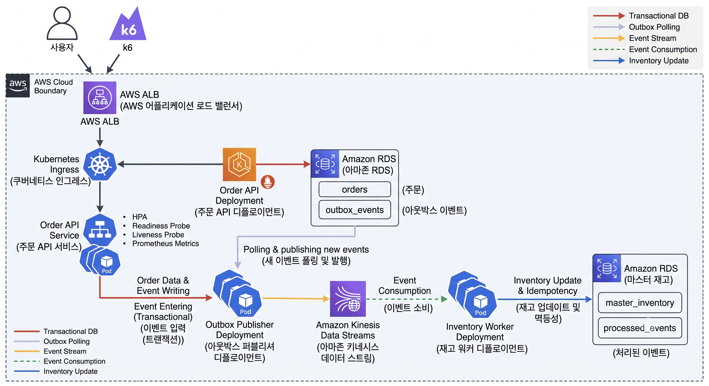

# 🛒 트래픽 폭증에도 흔들리지 않는, 정합성을 지키는 이커머스 재고 파이프라인

주문 요청과 재고 처리를 분리하여 트래픽 급증과 일부 컴포넌트 장애에도 안정적으로 주문 이벤트를 처리하는 AWS·Kubernetes 기반 이커머스 파이프라인입니다.

Outbox Pattern과 Amazon Kinesis Data Streams를 사용해 주문 이벤트 유실을 방지하고, Inventory Worker의 멱등성 처리와 조건부 재고 차감으로 데이터 정합성을 보장합니다.

---

## 🎯 프로젝트 목표

* 주문과 이벤트를 동일한 DB 트랜잭션으로 저장
* 주문 API와 재고 처리 시스템 분리
* 중복 이벤트가 발생해도 재고는 한 번만 차감
* 재고가 0보다 작아지지 않도록 조건부 차감
* 트래픽 증가 시 Order API Pod 자동 확장
* Git Push 이후 이미지 빌드부터 EKS 배포까지 자동화
* 전체 처리 흐름과 장애 상태를 Grafana에서 확인

---

## 📐 아키텍처



```text
k6 부하 테스트
      │
      ▼
AWS Application Load Balancer
      │
      ▼
Kubernetes Ingress
      │
      ▼
Order API Service
      │
      ▼
Order API Deployment + HPA
      │
      ├── orders
      └── outbox_events
             │
             ▼
     Outbox Publisher
             │
             ▼
Amazon Kinesis Data Streams
             │
             ▼
 Inventory Worker StatefulSet
             │
             ├── master_inventory
             └── processed_events
```

### 핵심 설계 원칙

Order API, Outbox Publisher, Inventory Worker는 직접 호출하지 않는 독립된 워크로드입니다.

RDS와 Kinesis를 매개로 비동기 연결되므로 하나의 컴포넌트가 느려지거나 장애가 발생해도 다른 컴포넌트로 장애가 직접 전파되는 것을 줄일 수 있습니다. 각 워크로드는 역할에 맞게 독립적으로 확장할 수 있습니다.

---

## 🔄 주문 처리 흐름

### 1. k6 부하 테스트

동시 사용자의 주문 요청을 생성해 타임세일이나 사전예약과 같은 트래픽 급증 상황을 재현합니다.

### 2. AWS ALB

인터넷 요청을 수신해 EKS 내부 Order API Pod로 전달하는 외부 진입점입니다.

### 3. Kubernetes Ingress

`/orders`, `/health` 요청을 `order-api-service`로 전달하는 라우팅 규칙입니다.

AWS Load Balancer Controller가 Ingress 리소스를 감지해 실제 ALB와 Target Group을 구성합니다.

### 4. Kubernetes Service

Pod가 재생성되어 IP가 바뀌어도 고정된 서비스 주소를 통해 정상 Pod로 요청을 전달합니다.

### 5. Order API

주문 요청을 받아 하나의 트랜잭션 안에서 다음 데이터를 함께 저장합니다.

* `orders`: 주문 정보
* `outbox_events`: Kinesis에 발행할 주문 이벤트

주문 저장과 이벤트 발행 정보를 하나의 트랜잭션으로 처리해 주문만 저장되고 이벤트가 유실되는 이중 쓰기 문제를 방지합니다.

### 6. Outbox Publisher

`outbox_events`의 `PENDING` 이벤트를 조회해 Kinesis로 발행합니다.

여러 Publisher Pod가 동시에 실행되어도 `SELECT ... FOR UPDATE SKIP LOCKED` 방식으로 서로 다른 이벤트를 처리합니다.

발행 결과는 다음 상태로 관리합니다.

* `PENDING`: 발행 대기
* `PUBLISHED`: 발행 완료
* `FAILED`: 최대 재시도 횟수 초과

### 7. Amazon Kinesis Data Streams

Order API와 Inventory Worker 사이의 비동기 이벤트 스트림입니다.

* Stream 이름: `ecommerce-order-events`
* 모드: `PROVISIONED`
* Shard 수: 3개
* 보관 기간: 24시간
* Partition Key: `order_id`

동일한 주문의 이벤트는 같은 Shard로 전달되어 Shard 내부 순서를 유지합니다.

### 8. Inventory Worker

Kinesis의 각 Shard에서 주문 이벤트를 소비합니다.

처리 과정은 다음과 같습니다.

1. `event_id` 처리 여부 확인
2. 중복 이벤트이면 재고 차감 생략
3. `product_id` 기준 현재 재고 조회
4. 재고가 충분한 경우에만 조건부 차감
5. 처리 결과를 `processed_events`에 저장
6. 성공·실패·재고 부족 메트릭 기록

Inventory Worker는 3개의 StatefulSet Pod로 실행되며 각 Pod가 하나의 Kinesis Shard를 담당합니다.

---

## 🗄️ 데이터베이스 구성

Amazon RDS MySQL을 사용하며 외부 인터넷에 공개하지 않고 Private Subnet에 배치했습니다.

| 테이블                | 역할                      |
| ------------------ | ----------------------- |
| `orders`           | 주문 정보 저장                |
| `outbox_events`    | Kinesis 발행 대상과 발행 상태 저장 |
| `master_inventory` | 상품별 현재 재고 저장            |
| `processed_events` | 이벤트 중복 방지 및 처리 결과 저장    |

### 상품 코드

| product_id | 모델    | 색상       |
| ---------: | ----- | -------- |
|        101 | FOLD  | BLACK    |
|        102 | FOLD  | WHITE    |
|        103 | FOLD  | LAVENDER |
|        104 | FOLD  | GRAY     |
|        201 | FLIP  | BLACK    |
|        202 | FLIP  | WHITE    |
|        203 | FLIP  | LAVENDER |
|        204 | FLIP  | GRAY     |
|        301 | ULTRA | BLACK    |
|        302 | ULTRA | WHITE    |
|        303 | ULTRA | LAVENDER |
|        304 | ULTRA | GRAY     |

`product_id`는 애플리케이션, 이벤트, 데이터베이스에서 `VARCHAR(10)` 형식으로 통일했습니다.

---

## ☸️ Kubernetes 구성

| 컴포넌트             | 리소스                           |     실행 수 |
| ---------------- | ----------------------------- | -------: |
| Order API        | Deployment + HPA              | 2~4 Pods |
| Outbox Publisher | Deployment                    |   3 Pods |
| Inventory Worker | StatefulSet                   |   3 Pods |
| Order API 외부 연결  | Ingress + ALB                 |       1개 |
| 애플리케이션 설정        | ConfigMap                     |       1개 |
| DB 인증정보          | Secret                        |       1개 |
| AWS 권한           | ServiceAccount + Pod Identity |       2개 |

### Order API 안정성 설정

| 구성               | 역할                             |
| ---------------- | ------------------------------ |
| HPA              | CPU 사용률에 따라 Pod 수 자동 조절        |
| Readiness Probe  | 요청을 처리할 준비가 된 Pod만 Service에 연결 |
| Liveness Probe   | 비정상 Pod 자동 재시작                 |
| Resource Request | HPA 계산과 스케줄링 기준 제공             |
| Resource Limit   | Pod의 최대 CPU·메모리 사용량 제한         |

HPA 부하 테스트에서 CPU 사용률 증가에 따라 Order API Pod가 1개에서 3개까지 확장되는 것을 확인했습니다. 최종 설정은 최소 2개, 최대 4개, 목표 CPU 사용률 50%입니다.

---

## 🔐 AWS 권한 관리

### EKS Pod Identity

Outbox Publisher와 Inventory Worker는 AWS Access Key를 Pod에 저장하지 않습니다.

EKS Pod Identity를 통해 ServiceAccount와 IAM Role을 연결해 필요한 Kinesis 권한만 임시로 부여합니다.

* Outbox Publisher: Kinesis 발행 권한
* Inventory Worker: Kinesis 조회·소비 권한

### GitHub Actions OIDC

GitHub Actions에도 장기 AWS Access Key를 저장하지 않습니다.

GitHub OIDC Token을 사용해 AWS IAM Role의 임시 자격 증명을 발급받고 ECR Repository에 이미지를 Push합니다.

IAM 신뢰 정책은 팀 GitHub 저장소의 `main` 브랜치에서 실행된 워크플로만 Role을 사용할 수 있도록 제한했습니다.

---

## 🚀 CI/CD 및 GitOps

```text
main 브랜치 Push
        │
        ▼
GitHub Actions
        │
        ├── GitHub OIDC 인증
        ├── Docker 이미지 3개 빌드
        └── Amazon ECR Push
                 │
                 ▼
Kubernetes 매니페스트 이미지 태그 변경
                 │
                 ▼
Argo CD 자동 동기화
                 │
                 ▼
Amazon EKS Rolling Update
```

### CI

GitHub Actions가 다음 세 이미지를 병렬로 빌드합니다.

* `order-api`
* `outbox-publisher`
* `inventory-worker`

이미지 태그는 Git Commit SHA를 사용해 어떤 코드가 배포됐는지 추적할 수 있도록 구성했습니다.

### CD

Argo CD는 다음 두 Application을 관리합니다.

| Application            | Git 경로        | 역할                             |
| ---------------------- | ------------- | ------------------------------ |
| `ecommerce-platform`   | `k8s/`        | 애플리케이션과 Kubernetes 리소스 배포      |
| `ecommerce-monitoring` | `monitoring/` | ServiceMonitor, 대시보드, 알림 규칙 배포 |

두 Application 모두 자동 동기화, `prune`, `selfHeal`을 사용하며 최종적으로 `Synced / Healthy` 상태를 확인했습니다.

---

## 📊 Prometheus 및 Grafana

Helm의 `kube-prometheus-stack`을 사용해 다음 구성요소를 설치했습니다.

* Prometheus
* Grafana
* Alertmanager
* Prometheus Operator
* kube-state-metrics
* Node Exporter

### 애플리케이션 메트릭 수집

| 서비스       | 주요 메트릭                                        | 의미            |
| --------- | --------------------------------------------- | ------------- |
| Order API | `order_requests_total`                        | 전체 주문 요청      |
| Order API | `order_success_total`                         | 주문 접수 성공      |
| Order API | `order_failure_total`                         | 주문 처리 실패      |
| Order API | `order_request_duration_seconds`              | 주문 API 처리시간   |
| Publisher | `outbox_pending_events`                       | 발행 대기 이벤트     |
| Publisher | `outbox_failed_events`                        | 최종 발행 실패 이벤트  |
| Publisher | `outbox_publish_total`                        | Kinesis 발행 성공 |
| Publisher | `outbox_publish_errors_total`                 | Kinesis 발행 실패 |
| Worker    | `inventory_processed_total`                   | 재고 처리 성공      |
| Worker    | `inventory_out_of_stock_total`                | 재고 부족         |
| Worker    | `inventory_duplicate_events_total`            | 중복 이벤트        |
| Worker    | `inventory_failed_total`                      | 재고 처리 실패      |
| Worker    | `inventory_processing_duration_seconds`       | 재고 처리시간       |
| Worker    | `inventory_kinesis_iterator_age_milliseconds` | Kinesis 소비 지연 |

각 서비스는 다음 경로 또는 포트로 Prometheus 메트릭을 제공합니다.

```text
Order API         : 8000/metrics
Outbox Publisher  : 8001/metrics
Inventory Worker  : 8002/metrics
```

ServiceMonitor를 사용해 세 서비스의 메트릭을 15초 간격으로 수집합니다.

### Grafana 대시보드

`Ecommerce Order & Inventory Pipeline` 대시보드에서 다음 항목을 확인할 수 있습니다.

* Order TPS
* 주문 실패율
* Order API P95 응답시간
* Outbox 대기·실패 이벤트
* Kinesis 발행 처리량
* Inventory Worker 처리량
* 재고 부족·중복·실패 이벤트
* Kinesis Iterator Age

### 장애 감지 규칙

| 알림                                   | 감지 조건                        |
| ------------------------------------ | ---------------------------- |
| `OrderApiFailureDetected`            | 최근 5분 동안 주문 처리 실패 발생         |
| `OutboxBacklogHigh`                  | Outbox 대기 이벤트가 2분 이상 100건 초과 |
| `OutboxPublishFailureDetected`       | Kinesis 발행 실패 발생             |
| `InventoryProcessingFailureDetected` | 재고 이벤트 처리 실패 발생              |
| `KinesisConsumerLagHigh`             | Kinesis 소비 지연이 2분 이상 60초 초과  |

현재는 Prometheus와 Grafana에서 장애를 감지하고 표시하는 범위까지 구현했습니다. Slack과 이메일 같은 외부 알림 채널은 연결하지 않았습니다.

---

## 🧪 최종 검증 결과

### 인프라 상태

* EKS Worker Node 2개 `Ready`
* Order API Pod 2개 `Running`
* Outbox Publisher Pod 3개 `Running`
* Inventory Worker Pod 3개 `Running`
* AWS ALB 생성 및 `/health` 응답 정상
* Argo CD Application 2개 `Synced / Healthy`
* ServiceMonitor 3개 등록
* PrometheusRule 5개 등록

### End-to-End 테스트

테스트 주문을 전송해 전체 파이프라인을 검증했습니다.

```text
ORDER     : CREATED
OUTBOX    : PUBLISHED
PROCESSED : SUCCESS
INVENTORY : 정상 차감
```

이를 통해 다음 처리가 정상적으로 이어지는 것을 확인했습니다.

```text
주문 요청
→ orders 저장
→ outbox_events 저장
→ Kinesis 발행
→ Inventory Worker 소비
→ processed_events 기록
→ master_inventory 재고 차감
```

### 부하 테스트

k6 부하 테스트에서 다음 항목을 확인했습니다.

* ALB를 통한 주문 요청 정상 처리
* Order API HPA 자동 확장
* 주문 처리량과 P95 응답시간 수집
* Publisher와 Worker 처리량 확인
* Outbox 처리 완료 후 Pending 0
* 주문·이벤트·재고 처리 전체 흐름 정상

소량 통합 테스트에서는 주문 실패 없이 약 79ms 수준의 Order API P95 응답시간을 확인했습니다.

---

## 👥 역할 분담

| 담당     | 기능 책임        | 애플리케이션·데이터                                          | 인프라·운영                                                           | 완료 기준                       |
| ------ | ------------ | --------------------------------------------------- | ---------------------------------------------------------------- | --------------------------- |
| 1번 반이연 | 주문 접수·트래픽 대응 | Order API, `orders`, 주문 검증, 주문 메트릭, k6              | Dockerfile, Deployment, Service, Ingress, HPA, Probe             | ALB 주문 요청과 HPA 확장 확인        |
| 2번 김성철 | 주문 이벤트 안전 전달 | `outbox_events`, Publisher, Kinesis 발행, 재시도         | Dockerfile, Deployment, Kinesis 발행 권한                            | Outbox 이벤트가 Kinesis까지 전달    |
| 3번 차현지 | 재고 처리·정합성    | Worker, `master_inventory`, `processed_events`, 멱등성 | StatefulSet, Kinesis 소비 권한, Worker 메트릭                           | 중복 차감 방지와 재고 음수 방지          |
| 4번 이광훈 | 공통 플랫폼·통합 운영 | 전체 연결 검증, 공통 설정, 통합 대시보드                            | VPC, EKS, RDS, ECR, GitHub Actions, Argo CD, Prometheus, Grafana | Git Push 자동배포와 전체 흐름·메트릭 확인 |

---

## 📁 저장소 구조

```text
jaekkag/
├── apps/
│   ├── order-api/
│   ├── outbox-publisher/
│   └── inventory-worker/
├── database/
│   ├── schema.sql
│   └── sample-data.sql
├── terraform/
├── k8s/
│   ├── base/
│   ├── order-api/
│   ├── publisher/
│   ├── inventory-worker/
│   ├── ingress/
│   └── hpa/
├── argocd/
├── monitoring/
│   ├── prometheus/
│   └── grafana/
├── load-test/
├── .github/
│   └── workflows/
└── readme.md
```

---

## 🛠️ 기술 스택

### Infrastructure

`Terraform` · `AWS VPC` · `Amazon EKS` · `Amazon RDS MySQL` · `Amazon ECR` · `Amazon Kinesis Data Streams` · `AWS ALB`

### Container & Kubernetes

`Docker` · `Kubernetes` · `Helm` · `AWS Load Balancer Controller` · `EKS Pod Identity` · `HPA` · `Metrics Server`

### CI/CD

`GitHub Actions` · `GitHub OIDC` · `Argo CD` · `Kustomize`

### Monitoring

`Prometheus` · `Grafana` · `Alertmanager` · `ServiceMonitor` · `PrometheusRule`

### Test

`k6`

---

## ⚠️ 현재 구현 범위

3일 프로젝트 범위에 맞춰 다음 항목까지 구현했습니다.

* AWS 및 EKS 인프라 자동 생성
* 이벤트 기반 주문·재고 처리
* 멱등성 및 조건부 재고 차감
* OIDC 기반 CI/CD
* Argo CD GitOps 자동 배포
* HPA 오토스케일링
* Prometheus·Grafana 통합 모니터링
* Prometheus 장애 감지 규칙

다음 항목은 후속 개선 범위입니다.

* DB Migration 자동화
* Alertmanager의 Slack·이메일 알림 연동
* HTTPS 및 사용자 도메인 적용
* 운영 환경용 Secret Manager 연동
* 장기 메트릭 보관을 위한 외부 스토리지 구성
* Kinesis Checkpoint 영속화 및 KCL 적용
