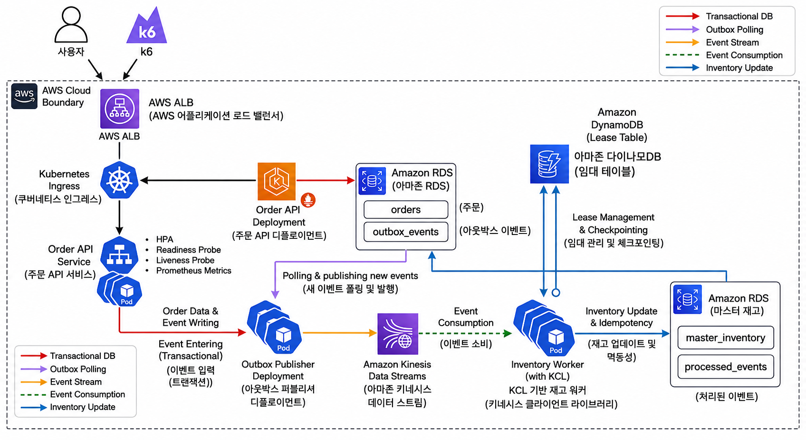

# 🛒 트래픽 폭증에도 흔들리지 않는, 정합성을 지키는 이커머스 재고 파이프라인

주문이 들어오면 재고를 정확하게, 안전하게 차감하는 이벤트 기반 파이프라인입니다.
Outbox Pattern과 Kinesis를 활용해 **주문 처리**와 **재고 반영**을 분리하고, 각 컴포넌트가 독립적으로 확장/장애 격리될 수 있도록 설계했습니다.

---

## 📐 아키텍처



```
k6(부하테스트) → AWS ALB → K8s Ingress → K8s Service → Order API Pod
                                                              │
                                                    (트랜잭션) 동시 저장
                                                              ▼
                                              RDS: orders + outbox_events
                                                              │
                                              (별도 파드) Outbox Publisher
                                                        가 폴링 후 발행
                                                              ▼
                                                 Amazon Kinesis Data Streams
                                                              │
                                              (별도 파드) Inventory Worker
                                                        가 소비 + 멱등성 처리
                                                              ▼
                                          RDS: master_inventory + processed_events
```

> **핵심 설계 원칙**: Order API, Outbox Publisher, Inventory Worker는 서로 직접 통신하지 않는 **3개의 독립된 파드**입니다. 데이터베이스 테이블과 Kinesis 스트림을 매개로 간접적으로 이어지기 때문에, 하나가 느려지거나 장애가 나도 나머지에 영향을 주지 않고 각자 필요한 만큼만 독립적으로 스케일할 수 있습니다.

---

## 🔄 단계별 흐름

### 1. k6 — 부하 테스트 도구
가짜 사용자들이 동시에 요청을 보내는 걸 시뮬레이션하는 테스트 도구. 블랙프라이데이 같은 트래픽 폭증 상황을 재현.

### 2. AWS ALB — 문지기
인터넷에 공개된 진입점. 들어온 요청을 등록된 여러 파드 중 하나로 라운드로빈 분산.

### 3. Kubernetes / EKS — 컨테이너 오케스트레이션
컨테이너(Docker 이미지 실행 단위)를 자동으로 관리. 파드 개수 유지, 장애 시 재시작, 트래픽 증가 시 확장을 담당.

- **Pod**: 컨테이너 실행 최소 단위

### 4. Kubernetes Ingress — 안내판
"어떤 경로로 온 요청을 어떤 Service로 보낼지" 정의하는 라우팅 규칙. 서비스가 여러 개로 늘어날 때 진가를 발휘.

### 5. Kubernetes Service — 대표 전화번호
파드는 계속 죽고 다시 생기며 IP가 바뀌므로, 항상 살아있는 파드로 연결해주는 고정 창구.

### 6. Order API Deployment — 주문 처리
주문 요청을 받아 처리하는 실제 애플리케이션. 다음 3가지가 함께 동작:

| 컴포넌트 | 역할 |
|---|---|
| **HPA** | CPU 사용률 기반으로 파드 개수 자동 조절 |
| **Readiness Probe** | 트래픽 받을 준비가 됐는지 체크, 미준비 시 라우팅 제외 |
| **Liveness Probe** | 파드 생존 여부 체크, 실패 시 자동 재시작 |

### 7. RDS 저장 — Outbox Pattern
Order API가 하나의 트랜잭션 안에서 두 테이블을 동시에 저장:

- `orders` — 주문 기록
- `outbox_events` — 재고 시스템에 나중에 전달할 이벤트 (임시 저장)

> 왜 바로 안 보내고 임시 저장하나? 주문 저장과 이벤트 발행을 각각 따로 처리하면 "주문은 성공, 이벤트 발송은 실패"하는 **이중쓰기 문제**가 생길 수 있음. 하나의 트랜잭션으로 묶어 원자성을 보장.

### 8. Outbox Publisher — 우체부
Order API와는 완전히 별개인 파드. `outbox_events` 테이블을 주기적으로 폴링하며 아직 발행 안 된 이벤트를 Kinesis로 전달.

### 9. Amazon Kinesis Data Streams — 실시간 이벤트 통로
AWS가 관리하는 완전관리형 스트리밍 서비스. EKS 클러스터 밖에 존재하며, 이벤트가 순서대로 대기하다가 소비자가 가져가는 구조.

### 10. Inventory Worker — 재고 담당자
Kinesis를 지켜보다 새 이벤트가 오면:

1. `event_id` 중복 처리 여부 확인 (멱등성 보장)
2. 처음 보는 이벤트면 `master_inventory`에서 재고 차감
3. 처리 결과 기록

### 11. 최종 저장 — RDS

- `master_inventory` — 실제 남은 재고
- `processed_events` — 중복 방지용 처리 이력

---

## 👥 전체 역할표

| | 기능 책임 | 애플리케이션 · 데이터 | 담당 인프라 · 운영 | 최종 완료 기준 |
|---|---|---|---|---|
| **1번 (반이연)** | 주문 접수 · 트래픽 대응 | Order API, `orders`, 주문 검증, 주문 메트릭, k6 | API Dockerfile, Deployment, Service, Ingress, ALB 경로, HPA, Probe | ALB로 주문 요청이 들어오고 부하 발생 시 API Pod가 확장됨 |
| **2번 (김성철)** | 주문 이벤트 안전 전달 | `outbox_events`, Outbox Publisher, Kinesis 발행, 발행 상태 · 메트릭 | Kinesis Terraform, Publisher Dockerfile · Deployment, IAM 발행 권한 | 주문 이벤트가 Outbox에서 Kinesis까지 유실 없이 전달됨 |
| **3번 (차현지)** | 재고 처리 · 정합성 | Inventory Worker, `master_inventory`, `processed_events`, 멱등성, 조건부 차감 | Worker Dockerfile · Deployment, Kinesis 소비 IAM, Worker 메트릭 | 중복 이벤트는 한 번만 처리되고 재고가 음수가 되지 않음 |
| **4번 (이광훈)** | 공통 플랫폼 · 통합 운영 | 전체 연결 검증, 공통 설정, Grafana 대시보드 | VPC, EKS, RDS, ECR, GitHub Actions, Argo CD, Prometheus, Grafana | Git Push 후 자동 배포되고 전체 흐름과 메트릭을 확인할 수 있음 |

---

## 🛠️ 기술 스택

`Terraform` · `AWS EKS` · `Amazon Kinesis Data Streams` · `Amazon RDS` · `ECR` · `GitHub Actions` · `Argo CD` · `Prometheus` · `Grafana` · `k6`
