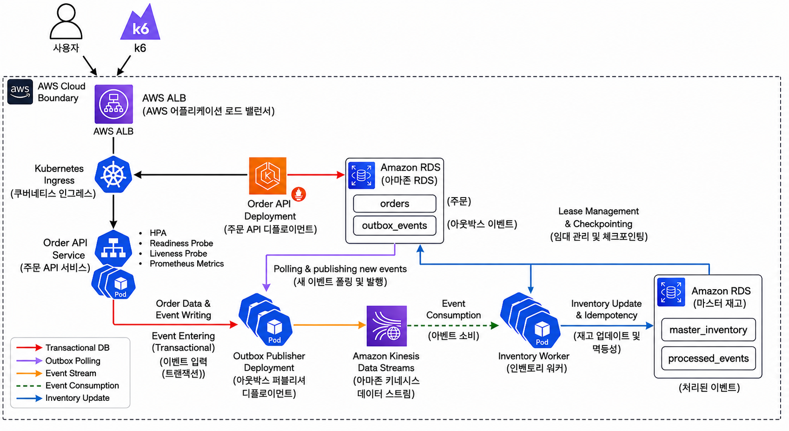
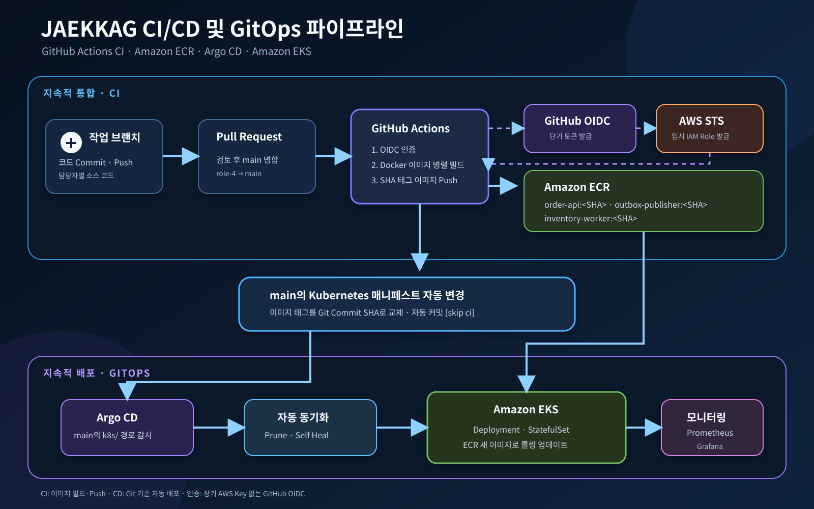

# 🛒 재깍 — 트래픽 폭증에도 정합성을 지키는 이커머스 재고 파이프라인

주문 요청과 재고 처리를 분리하여, 트래픽 급증과 일부 컴포넌트 장애 상황에서도 안정적으로 주문 이벤트를 처리하는 AWS·Kubernetes 기반 이커머스 파이프라인입니다.

Outbox Pattern과 Amazon Kinesis Data Streams로 주문 이벤트 유실을 방지하고, Inventory Worker의 멱등성 처리와 조건부 재고 차감으로 데이터 정합성을 보장합니다.

## 목차

- 🛒 [프로젝트 소개](#프로젝트-소개)
- 📐 [아키텍처](#아키텍처)
- 🗄️ [데이터베이스 구성](#데이터베이스-구성)
- ☸️ [Kubernetes 구성](#kubernetes-구성)
- 🔐 [AWS 권한 관리](#aws-권한-관리)
- 🚀 [CI/CD 및 GitOps](#cicd-및-gitops)
- 📊 [모니터링](#모니터링)
- 🧪 [테스트 및 검증 결과](#테스트-및-검증-결과)
- 🛠️ [팀 및 기술 스택](#팀-및-기술-스택)
- 🏁 [구현 범위 및 결론](#구현-범위-및-결론)

---

## 🛒 프로젝트 소개

| 목표 | 내용 |
|---|---|
| 정합성 | 주문과 이벤트를 동일한 DB 트랜잭션으로 저장, 중복 이벤트가 발생해도 재고는 한 번만 차감 |
| 안전성 | 재고가 0보다 작아지지 않도록 조건부 차감 |
| 확장성 | 트래픽 증가 시 Order API Pod 자동 확장 (HPA) |
| 자동화 | Git Push 이후 이미지 빌드부터 EKS 배포까지 자동화 (CI/CD + GitOps) |
| 가시성 | 전체 처리 흐름과 장애 상태를 Prometheus / Grafana에서 확인 |
| IaC | Terraform으로 AWS 인프라를 코드로 관리 |

Order API, Outbox Publisher, Inventory Worker는 서로 직접 호출하지 않는 독립적인 워크로드로 구성했습니다. RDS와 Kinesis를 매개로만 비동기 연결되므로, 한 컴포넌트의 지연이나 장애가 다른 컴포넌트로 즉시 전파되지 않습니다.

---

## 📐 아키텍처



**처리 흐름 요약**

```text
주문 요청 → Order API → orders / outbox_events 저장 (1개 트랜잭션)
         → Outbox Publisher → Kinesis Data Streams 발행
         → Inventory Worker → 재고 조건부 차감 → processed_events 기록
```

| 구성요소 | 역할 |
|---|---|
| ALB → Ingress → Order API Service | 외부 요청을 정상 상태의 Order API Pod로 전달 |
| Order API | 주문 정보와 Outbox 이벤트를 하나의 트랜잭션으로 저장 (이중 쓰기 문제 방지) |
| Outbox Publisher | `PENDING` 이벤트를 조회해 Kinesis로 발행. `SELECT ... FOR UPDATE SKIP LOCKED`로 다중 Pod 간 안전하게 분배 |
| Amazon Kinesis Data Streams | `order_id`를 Partition Key로 사용해 동일 주문 이벤트의 순서를 Shard 내에서 보장 (3 Shard, 24시간 보관) |
| Inventory Worker | `event_id` 처리 여부 확인 → 조건부 재고 차감 → `processed_events` 기록 (3개 StatefulSet Pod, Shard별 병렬 소비) |

---

## 🗄️ 데이터베이스 구성

Amazon RDS MySQL을 Private Subnet에 배치하고 외부에 공개하지 않았습니다.

### orders

```sql
CREATE TABLE orders (
    order_id      BIGINT       AUTO_INCREMENT PRIMARY KEY,
    product_id    VARCHAR(10)  NOT NULL,
    quantity      INT          NOT NULL,
    order_status  ENUM('CREATED','CONFIRMED','CANCELLED')  NOT NULL DEFAULT 'CREATED',
    created_at    DATETIME     NOT NULL DEFAULT CURRENT_TIMESTAMP,
    updated_at    DATETIME     NOT NULL DEFAULT CURRENT_TIMESTAMP ON UPDATE CURRENT_TIMESTAMP,

    INDEX idx_product_id (product_id),
    INDEX idx_created_at (created_at)
);
```

| 컬럼 | 의미 |
|---|---|
| `order_id` | 주문을 유일하게 식별하는 자동 증가 번호 |
| `product_id` | 상품 코드 (기종+색상 인코딩, 예: `203`) |
| `quantity` | 주문 수량 |
| `order_status` | 주문의 생애주기 상태 — `CREATED`(접수, 재고 확정 전) → `CONFIRMED`(재고 차감 성공) / `CANCELLED`(재고 부족 등으로 취소) |
| `created_at` / `updated_at` | 생성 시각 / 상태 마지막 변경 시각 |

### outbox_events

```sql
CREATE TABLE outbox_events (
    id            BIGINT       AUTO_INCREMENT PRIMARY KEY,
    event_id      VARCHAR(36)  NOT NULL UNIQUE,
    event_type    VARCHAR(50)  NOT NULL,
    order_id      BIGINT       NOT NULL,
    product_id    VARCHAR(10)  NOT NULL,
    quantity      INT          NOT NULL,
    publish_status ENUM('PENDING','PUBLISHED','FAILED') NOT NULL DEFAULT 'PENDING',
    retry_count   INT          NOT NULL DEFAULT 0,
    last_error    TEXT         NULL,
    created_at    DATETIME     NOT NULL DEFAULT CURRENT_TIMESTAMP,
    published_at  DATETIME     NULL,

    INDEX idx_status_created (publish_status, created_at)
);
```

| 컬럼 | 의미 |
|---|---|
| `event_id` | 이벤트 한 건을 유일하게 식별하는 UUID. Worker가 중복 처리 여부를 판단하는 핵심 키 |
| `order_id` / `product_id` / `quantity` | 파생된 주문의 식별자·상품·수량 (Kinesis로 그대로 전달) |
| `publish_status` | Kinesis 발행 상태 — `PENDING`(대기) → `PUBLISHED`(성공) / `FAILED`(실패, 다음 폴링에서 재시도) |
| `retry_count` / `last_error` | 발행 재시도 횟수 및 최근 실패 원인 |
| `created_at` / `published_at` | 이벤트 기록 시각 / 실제 발행 성공 시각 |

**Kinesis payload 예시**

```json
{
  "event_id": "550e8400-e29b-41d4-a716-446655440000",
  "event_type": "ORDER_CREATED",
  "order_id": 1001,
  "product_id": "203",
  "quantity": 2,
  "created_at": "2026-08-05T09:00:00Z"
}
```

### master_inventory (재고 관리)

```sql
CREATE TABLE IF NOT EXISTS master_inventory (
    product_id       VARCHAR(10)  NOT NULL,
    model_name       VARCHAR(30)  NOT NULL,
    color_name       VARCHAR(30)  NOT NULL,
    stock_quantity   INT          NOT NULL,
    updated_at       DATETIME(6)  NOT NULL
                                  DEFAULT CURRENT_TIMESTAMP(6)
                                  ON UPDATE CURRENT_TIMESTAMP(6),

    PRIMARY KEY (product_id),
    CONSTRAINT uq_master_inventory_model_color UNIQUE (model_name, color_name),
    CONSTRAINT chk_master_inventory_stock CHECK (stock_quantity >= 0),
    CONSTRAINT chk_master_inventory_model CHECK (model_name IN ('FOLD', 'FLIP', 'ULTRA')),
    CONSTRAINT chk_master_inventory_color CHECK (color_name IN ('BLACK', 'WHITE', 'LAVENDER', 'GRAY'))
);
```

| 컬럼 | 필요한 이유 |
|---|---|
| `product_id` | Kinesis 이벤트와 재고 행을 연결하는 공통 키 |
| `model_name` / `color_name` | 대시보드에서 기종별·색상별 재고 집계 |
| `stock_quantity` | Inventory Worker가 실제로 차감하는 현재 재고. `CHECK (>= 0)`로 DB 레벨에서도 음수 방지 |
| `updated_at` | 재고 마지막 변경 시각 |

### processed_events (중복 방지 및 처리 결과)

```sql
CREATE TABLE IF NOT EXISTS processed_events (
    event_id         CHAR(36)      NOT NULL,
    order_id         BIGINT        NOT NULL,
    product_id       VARCHAR(10)   NOT NULL,
    model_name       VARCHAR(30)   NOT NULL,
    color_name       VARCHAR(30)   NOT NULL,
    quantity         INT           NOT NULL,
    process_status   VARCHAR(30)   NOT NULL,
    error_message    TEXT          NULL,
    processed_at      DATETIME(6)   NOT NULL DEFAULT CURRENT_TIMESTAMP(6),

    PRIMARY KEY (event_id),
    CONSTRAINT chk_processed_events_quantity CHECK (quantity > 0),
    CONSTRAINT chk_processed_events_status CHECK (process_status IN ('SUCCESS', 'OUT_OF_STOCK', 'FAILED')),
    CONSTRAINT chk_processed_events_model CHECK (model_name IN ('FOLD', 'FLIP', 'ULTRA')),
    CONSTRAINT chk_processed_events_color CHECK (color_name IN ('BLACK', 'WHITE', 'LAVENDER', 'GRAY')),

    INDEX idx_processed_events_order_id (order_id),
    INDEX idx_processed_events_product_id (product_id),
    INDEX idx_processed_events_status (process_status),
    INDEX idx_processed_events_processed_at (processed_at)
);
```

| 컬럼 | 필요한 이유 |
|---|---|
| `event_id` (PK) | 동일 Kinesis 이벤트 재전달 시 중복 처리를 막는 멱등성 키 |
| `process_status` | 재고 차감 성공(`SUCCESS`) / 품절(`OUT_OF_STOCK`) / 시스템 실패(`FAILED`) 구분 |
| `error_message` | `FAILED` 발생 시 원인 기록 |
| `processed_at` | 처리 시각 및 지연 확인 |

### 상품 코드

| product_id | 모델 | 색상 | | product_id | 모델 | 색상 |
|---|---|---|---|---|---|---|
| 101 | FOLD | BLACK | | 201 | FLIP | BLACK |
| 102 | FOLD | WHITE | | 202 | FLIP | WHITE |
| 103 | FOLD | LAVENDER | | 203 | FLIP | LAVENDER |
| 104 | FOLD | GRAY | | 204 | FLIP | GRAY |
| 301 | ULTRA | BLACK | | 302 | ULTRA | WHITE |
| 303 | ULTRA | LAVENDER | | 304 | ULTRA | GRAY |

### RDS 개선 (부하 테스트 기반)

Spike Test에서 RDS 연결 수가 `54/61`까지 증가하는 것을 확인하고 다음과 같이 개선했습니다.

| 구분 | 초기 | 최종 |
|---|---|---|
| 인스턴스 | `db.t3.micro` | `db.t3.small` |
| 적용 방식 | 일반 적용 | `apply_immediately = true` |
| 연결 관리 | 기본 설정 | 컴포넌트별 연결 풀 크기 조정 |

---

## ☸️ Kubernetes 구성

| 컴포넌트 | 리소스 | 실행 수 |
|---|---|---:|
| Order API | Deployment + HPA | 2~4 Pods |
| Outbox Publisher | Deployment | 3 Pods |
| Inventory Worker | StatefulSet | 3 Pods |
| 외부 연결 | Ingress + ALB | 1개 |
| 설정 / 인증정보 | ConfigMap / Secret | 1개씩 |
| AWS 권한 | ServiceAccount + Pod Identity | 2개 |

**Order API 안정성 설정**: Readiness/Liveness Probe로 비정상 Pod 자동 제외·재시작, Resource Request/Limit으로 HPA 계산 기준 및 자원 상한 설정.

**HPA 최종 설정**: 최소 2 / 최대 4 Pod, 목표 CPU 사용률 50%. Spike Test에서 부하 증가 시 자동 확장, 부하 감소 후 최소 Replica로 축소되는 것을 확인했습니다.

---

## 🔐 AWS 권한 관리

| 방식 | 대상 | 내용 |
|---|---|---|
| EKS Pod Identity | Outbox Publisher, Inventory Worker | AWS Access Key를 Pod에 직접 저장하지 않고, ServiceAccount ↔ IAM Role 연결로 임시 자격 증명만 부여 (Kinesis 발행/소비 권한) |
| GitHub OIDC | GitHub Actions | 장기 Access Key 없이 OIDC 토큰으로 임시 자격 증명 발급 후 ECR Push. IAM 신뢰 정책은 `main` 브랜치 워크플로만 허용 |

---

## 🚀 CI/CD 및 GitOps



| 단계 | 내용 |
|---|---|
| CI (GitHub Actions) | `order-api`, `outbox-publisher`, `inventory-worker` 3개 이미지를 병렬 빌드, Git Commit SHA로 태깅 후 ECR Push |
| CD (Argo CD) | `ecommerce-platform`(앱/K8s 리소스), `ecommerce-monitoring`(모니터링 리소스) 2개 Application을 자동 동기화 + `prune` + `selfHeal`로 관리 |

두 Application 모두 최종적으로 `Synced / Healthy` 상태를 확인했습니다.

---

## 📊 모니터링

Helm `kube-prometheus-stack`(Prometheus, Grafana, Alertmanager, Operator, kube-state-metrics, Node Exporter)을 설치하고, ServiceMonitor로 3개 서비스의 메트릭을 15초 간격 수집합니다.

| 서비스 | 포트 | 주요 메트릭 |
|---|---|---|
| Order API | `8000/metrics` | 요청/성공/실패 수, 처리시간(P95) |
| Outbox Publisher | `8001/metrics` | 발행 대기/실패 이벤트, Kinesis 발행 성공/실패 |
| Inventory Worker | `8002/metrics` | 처리 성공/품절/중복/실패, Kinesis Iterator Age |

**Grafana 대시보드**: Order TPS, 주문 실패율, P95 응답시간, Outbox 대기·실패, Kinesis 발행량, Worker 처리량·재고부족·중복·실패, Kinesis Iterator Age를 한 화면에서 확인합니다.

**장애 감지 규칙**: 주문 처리 실패, Outbox 대기 100건 초과(2분 이상), Kinesis 발행 실패, 재고 이벤트 처리 실패, Kinesis 소비 지연 60초 초과(2분 이상)를 PrometheusRule로 감지합니다. (Slack/이메일 등 외부 알림 채널 연동은 아직 미구현)

---

## 🧪 테스트 및 검증 결과

k6 부하 테스트와 장애 주입으로 6가지 시나리오를 검증했습니다.

| 순서 | 파일 | 검증 목적 |
|---:|---|---|
| 1 | `⭐ 01-order-test.js` | 일반 주문 및 전체 파이프라인 정상 처리 |
| 2 | `⭐ 02-spike-test.js` | 순간 트래픽 증가와 HPA 확장 |
| 3 | `03-hpa-watch.md` / `04-kinesis-lag.md` | Pod·HPA 변화, Kinesis 처리 지연 관찰 |
| 4 | `05-stockout-test.js` | 동시 주문에서 재고 음수 방지 |
| 5 | `06-worker-failure.md` | Worker 장애 중 이벤트 보존과 복구 |
| 6 | `07-duplicate-test.ps1` | 중복 이벤트 멱등성 처리 |
| 7 | `08-final-check.md` | 최종 상태 종합 확인 |

### 측정 결과

| 구분 | 요청 결과 | 처리량 | 평균 응답시간 | P95 | 최대 |
|---|---:|---:|---:|---:|---:|
| 일반 부하 | 902/902 성공 | 22.35건/초 | 219ms | 269ms | 486ms |
| Spike Test | 3,314/3,314 성공 | 60.25건/초 | 246.48ms | 403.77ms | 977.89ms |

전 구간 요청 성공, HPA 자동 확장(2→4 Pod), Worker 장애 후 이벤트 복구, 중복 이벤트 1회만 차감, 재고 음수 미발생을 확인했습니다.

**지연시간 분석**
 
Spike Test의 최대 응답시간(977ms)은 평균(246ms) 대비 약 4배 벌어졌습니다. 원인은 두 가지가 겹친 것으로 확인했습니다.
 
- **Pod 콜드 스타트**: HPA가 신규 Pod를 기동하는 짧은 과도기 동안, 기존 Pod만으로 늘어난 트래픽을 처리해야 했습니다.
- **RDS 커넥션 풀 경합**: RDS Proxy 없이 각 Pod가 DB에 직접 연결하는 구조라, Pod 수가 늘어날 때마다 커넥션 풀 요청이 함께 늘면서 대기가 발생했습니다.
두 지연이 같은 과도기 구간에서 겹치며 꼬리 구간(P95~최대) 응답시간을 끌어올린 것으로 보입니다. 후속 개선 과제로 남긴 **RDS Proxy 도입**과 **최소 Replica 상향**이 이 구간을 완화할 수 있을 것으로 예상합니다.
### 발견하고 개선한 문제

| 문제 | 원인 | 개선 |
|---|---|---|
| RDS 연결 수 증가 | 3개 컴포넌트의 동시 DB 연결 증가 | 인스턴스 `db.t3.small` 전환 + 컴포넌트별 연결 풀 조정 |
| 순간 트래픽 증가 | Order API 처리량 급증 | HPA(최소 2 / 최대 4 / CPU 50%) 적용 |
| 주문·이벤트 이중 쓰기 | 저장과 발행 시점 분리 | Transactional Outbox Pattern 적용 |
| 중복 이벤트 재처리 | Kinesis 재전달 가능성 | `processed_events` 기반 멱등성 처리 |
| 동시 주문 재고 경쟁 | 여러 Worker의 동일 상품 차감 | 조건부 재고 차감 (`CHECK` + WHERE 조건) |
| 장기 AWS Key 노출 위험 | 정적 인증정보 사용 가능성 | EKS Pod Identity + GitHub OIDC로 임시 자격 증명 전환 |

---

## 🛠️ 팀 및 기술 스택

### 역할 분담

| 담당 | 기능 책임 | 인프라·운영 |
|---|---|---|
| 반이연 (role-1) | Order API, 주문 검증/메트릭, k6 | Dockerfile, Deployment/Service/Ingress/HPA/Probe |
| 김성철 (role-2) | Outbox Publisher, Kinesis 발행/재시도 | Dockerfile, Deployment, Kinesis 발행 권한 |
| 차현지 (role-3) | Inventory Worker, 재고 정합성/멱등성 | StatefulSet, Kinesis 소비 권한, Worker 메트릭 |
| 이광훈 (role-4) | 통합 검증, 공통 설정/대시보드 | VPC/EKS/RDS/ECR, GitHub Actions, Argo CD, Prometheus/Grafana |

### 기술 스택

| 영역 | 스택 |
|---|---|
| Infra(북부 버즈니아 고정) | Terraform, AWS VPC/EKS/RDS MySQL/ECR/Kinesis/ALB |
| Container/K8s | Docker, Kubernetes, Helm, AWS Load Balancer Controller, EKS Pod Identity, HPA, Deployment/StatefulSet/Service/Ingress/ConfigMap/Secret |
| CI/CD | GitHub Actions, GitHub OIDC, Argo CD, Kustomize |
| Monitoring | Prometheus, Grafana, Alertmanager, ServiceMonitor, PrometheusRule |
| Test | k6, PowerShell, kubectl |

### 저장소 구조

```text
jaekkag/
├── apps/
│   ├── order-api/
│   ├── outbox-publisher/
│   └── inventory-worker/
├── database/
│   ├── schema.sql
│   └── sample-data.sql
├── terraform/
├── k8s/
│   ├── base/
│   ├── order-api/
│   ├── publisher/
│   ├── inventory-worker/
│   ├── ingress/
│   └── hpa/
├── argocd/
├── monitoring/
│   ├── prometheus/
│   └── grafana/
├── load-test/
│   ├── 01-order-test.js
│   ├── 02-spike-test.js
│   ├── 03-hpa-watch.md
│   ├── 04-kinesis-lag.md
│   ├── 05-stockout-test.js
│   ├── 06-worker-failure.md
│   ├── 07-duplicate-test.ps1
│   └── 08-final-check.md
├── scripts/
├── .github/
│   └── workflows/
└── README.md
```


---

## 🏁 구현 범위 및 결론

**구현 및 검증 완료**: Terraform 기반 AWS/EKS 인프라, Transactional Outbox + Kinesis 3-Shard 비동기 처리, Inventory Worker 멱등성·조건부 차감, EKS Pod Identity/GitHub OIDC 기반 무키(no static key) 인증, GitHub Actions + Argo CD GitOps 자동 배포, HPA 오토스케일링, Prometheus/Grafana 통합 모니터링, 일반/Spike/재고부족/장애/중복 시나리오 End-to-End 검증.

**후속 개선 범위**

- 💡 Outbox Polling → CDC 기반 이벤트 발행으로 전환
- Grafana Alerting → Slack / Amazon SNS 알림 연동
- 💡 RDS Proxy 도입으로 DB Connection 관리 개선
- HTTPS·사용자 도메인 적용, AWS Secrets Manager 기반 운영용 Secret 관리
- 장기간 부하 테스트 및 장애 복구 자동화

단순 주문 API 구현을 넘어, 트래픽 증가와 컴포넌트 장애 상황에서도 주문 이벤트를 안전하게 전달하고 재고 정합성을 유지하는 인프라·DevOps 환경을 구성했습니다. Terraform 인프라 자동화, Kubernetes 운영, CI/CD·GitOps, Prometheus/Grafana 모니터링을 하나의 흐름으로 통합하고, 실제 부하·장애 테스트로 병목을 발견하고 개선했습니다.